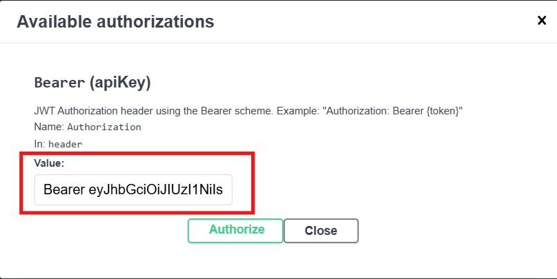

# 🛠️ Como Rodar o Projeto
Este arquivo proporciona instruções para rodar e testar a API do Simplified Bank.

## Pré-requisitos
- [.NET SDK 8.0](https://dotnet.microsoft.com/download/dotnet/8.0)
- [Docker](https://www.docker.com/products/docker-desktop/)
- [Git](https://git-scm.com/downloads) (para clonar o repo)

## Usando Docker (Recomendado)
1. Clone o repositório
```bash
git clone https://github.com/Pedro-Lucas-OKB/simplified-bank.git
cd simplified-bank
```

2. Execute com Docker Compose
- Dentro da pasta do projeto, execute o comando:
```bash
docker compose up --build -d
```

3. Acesse a API
- >A API estará disponível em: http://localhost:5163
- >Swagger UI: http://localhost:5163/swagger
- >Banco de dados: localhost,1433

4. Teste os endpoints 
.png)

5. Encerrando os containers
- Execute o comando abaixo para parar a execução dos containers:
```bash
docker compose down
```

## Execução Local (Sem Docker)
1. Clone o repositório
```bash
git clone https://github.com/Pedro-Lucas-OKB/simplified-bank.git
cd simplified-bank
```
2. Execute uma instância do SQL Server localmente
- Sugiro [este tutorial](https://blog.balta.io/sql-server-docker/) via Docker.
- Ou use o [SQL Server Express](https://www.microsoft.com/pt-br/sql-server/sql-server-downloads).

3. Configure a string de conexão
- Abra o arquivo `SimplifiedBank.Api/appsettings.Development.json`.
- Ajuste a ConnectionString conforme seu ambiente.

4. Inicie a aplicação
- Considerando a pasta raiz do projeto, execute o comando:
```bash
dotnet run --project .\src\SimplifiedBank.Api\SimplifiedBank.Api.csproj
```

5. Execute as migrações do banco de dados
- O projeto tentará aplicar a última migração automaticamente no início da execução.
- Caso ocorra algum erro, execute o comando abaixo:
```bash
dotnet ef database update --project .\src\SimplifiedBank.Api\SimplifiedBank.Api.csproj
```

6. Acesse a API
- >A API estará disponível em: http://localhost:5163
- >Swagger UI: http://localhost:5163/swagger

7. Executando com HTTPS
- Rode o projeto com:
```bash
 dotnet run --project .\src\SimplifiedBank.Api\SimplifiedBank.Api.csproj -lp https
```
- >A API estará disponível via HTTPS em: https://localhost:7091
- Caso ainda não tenha configurado o uso de HTTPS em aplicações .NET no seu sistema, siga [este tutorial](https://docs.microsoft.com/pt-br/aspnet/core/security/enforcing-ssl?view=aspnetcore-6.0&tabs=visual-studio).

## Endpoints Principais
- POST /v1/Users/register - Criar novo usuário
- POST /v1/Users/login - Autenticar usuário
- POST /v1/Users/me/new-transaction - Realizar transferência
- GET /v1/Users/me/get-info/transactions/sent - Listar transferências enviadas
- GET /v1/Users/me/get-info/transactions/received - Listar transferências recebidas

## Endpoints de Administrator
- Alguns endpoints são exclusivos para usuários autenticados como administradores.
- Para cadastrar um usuário como admin:
    - insira manualmente na tabela _Users_ um novo usuário com o campo '_Type_' definido como 'Admin';
    - ou altere o campo '_Type_' de um usuário existente para 'Admin'.
### Exemplo de endpoint de administrador
- .png)
- .png)

## Notificações via e-mail
O projeto utiliza o [smtp4dev](https://github.com/rnwood/smtp4dev) para representar o envio de notificações via e-mail para os usuários.

Os usuários serão notificados quando:
- Realizarem o cadastro no sistema
- Enviarem uma nova transação
- Receberem uma nova transação

### Acessando as notificações
> Para visualizar os e-mails enviados, acesse a interface web do smtp4dev via: http://localhost:5000/

Nessa interface, é possível acessar cada e-mail enviado pelo sistema. 

Para visualizar o conteúdo do e-mail, basta selecionar um da lista apresentada.

## Estrutura do Banco de Dados
- O banco de dados será criado automaticamente ao executar as migrações.

> - Nome do banco: SimplifiedBank
> - Usuário padrão (Docker): sa
> - Senha padrão (Docker): 1q2w3e4r@#$

## Observações
- A documentação completa da API está disponível no Swagger.
- Use o Swagger UI para testar os endpoints.
- Todos os endpoints de transferência requerem autenticação JWT.
- Para testar transferências, crie um usuário **comum** e um **lojista**.
- O token JWT deve ser incluído no header como "Bearer {token}"
  - Exemplo: 

## Solução de Problemas
- Verifique se as portas 5163 e 1433 estão disponíveis.
- Certifique-se que o Docker Desktop está em execução.
- Para logs do Docker: `docker compose logs -f`.
- Para reiniciar os serviços: `docker compose restart`.